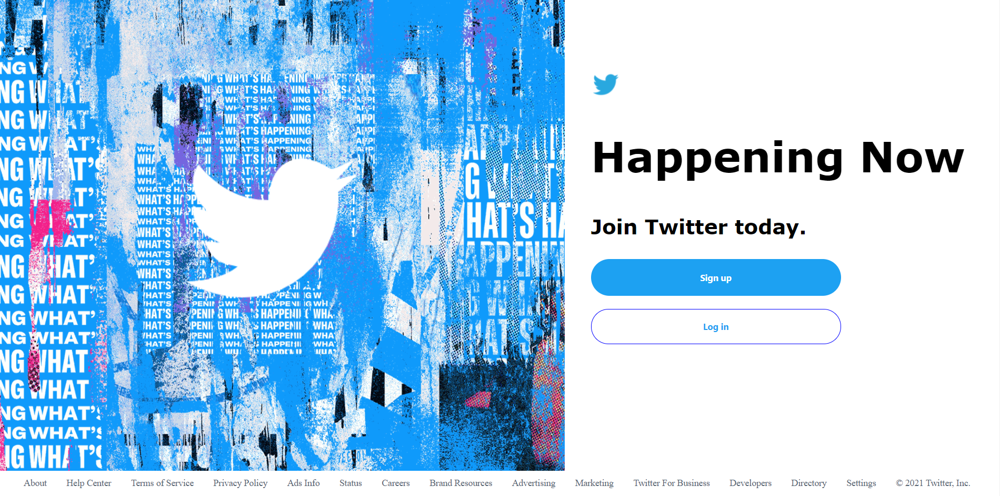

# Twitter Clone
> Outline a brief description of your project.
> Live demo [_here_](https://twitter-backend-mern.herokuapp.com/). <!-- If you have the project hosted somewhere, include the link here. -->

## Table of Contents
* [General Info](#general-information)
* [Technologies Used](#technologies-used)
* [Features](#features)
* [Screenshots](#screenshots)
* [Project Status](#project-status)
* [Room for Improvement](#room-for-improvement)
* [Acknowledgements](#acknowledgements)
* [Contact](#contact)
<!-- * [License](#license) -->

## General Information
- What is the purpose of your project?

The purpose of this project was to learn more about the backend and frontend of the projects. In this case, I've built a full-stack project with MongoDB, React, Express and NodeJS.

- Why did you undertake it?

I undertook this project because it was the final one on the TOP curriculum and because I wanted to practice by doing instead of just reading.

## Technologies Used
- React - version 17
- MongoDB - version 4.4
- CSS - version 2.1

## Features
List the ready features here:
- Users registration connected to database. 
- Each user can post their tweet and the name will be assigned.
- Authentication system.

## Screenshots

<!-- If you have screenshots you'd like to share, include them here. -->

## Project Status
Project is: in Progress.

## Room for Improvement
Include areas you believe need improvement / could be improved. Also add TODOs for future development.

Room for improvement:
- Comments are still not working.
- The user should be able to add a profile.

To do:
- Comments section.
- Let the user add images.

## Contact
Created by [@arstix]() - feel free to contact me!

<!-- Optional -->
<!-- ## License -->
<!-- This project is open source and available under the [... License](). -->

<!-- You don't have to include all sections - just the one's relevant to your project -->
